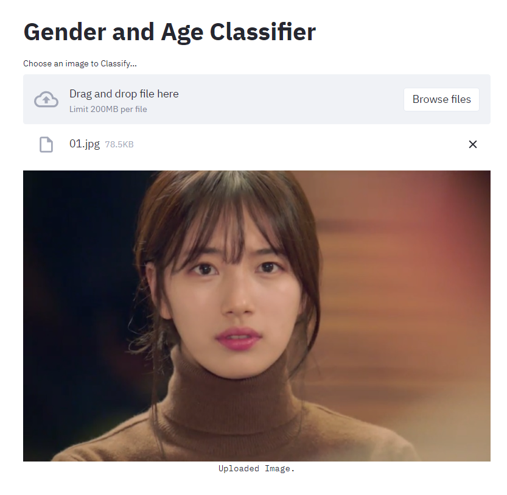
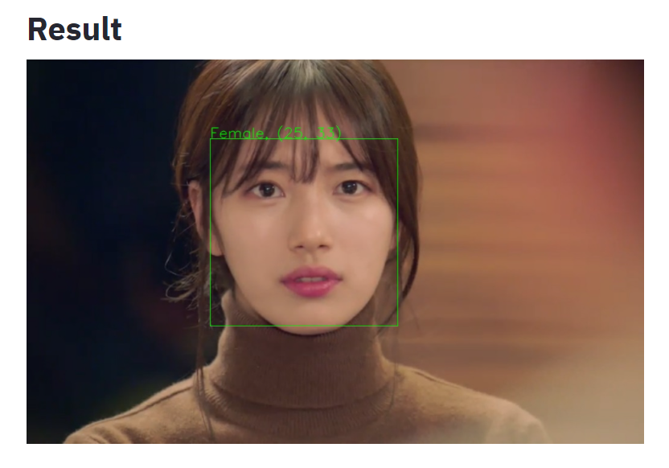
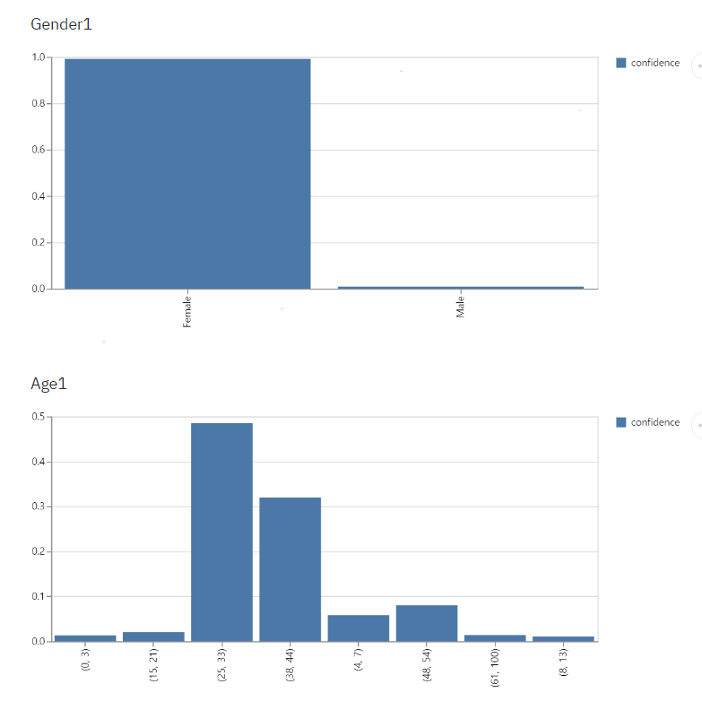

# Gender and Age Classifier
> Gender and Age Classifier는 사람의 얼굴을 인식하여 얼굴 객체를 찾고 그 객체에 대한 나이와 성별 정보를 분류하는 분류기이다.
> 성별과 나이 범위에 대해 결과 영상 밑의 바 차트에서 각각의 confidence를 확인할 수 있다.

Browse File을 클릭해 사진을 선택하면 얼굴 객체들을 찾아 사각형을 그려주고,

각 객체들의 성별과 나이 범위를 함께 return 해준다.

또한, 결과 영상 밑에서는 각 객체들의 성별과 나이 범위에 대한 confidence를 바 차트 형태로 나타내준다.

## 사용 라이브러리

numpy

opencv-python

streamlit

dlib

Image from PIL

pandas

## 사용 영상
https://www.youtube.com/watch?v=Vt7OfXkMrnU

## 참고
https://github.com/GilLevi/AgeGenderDeepLearning
